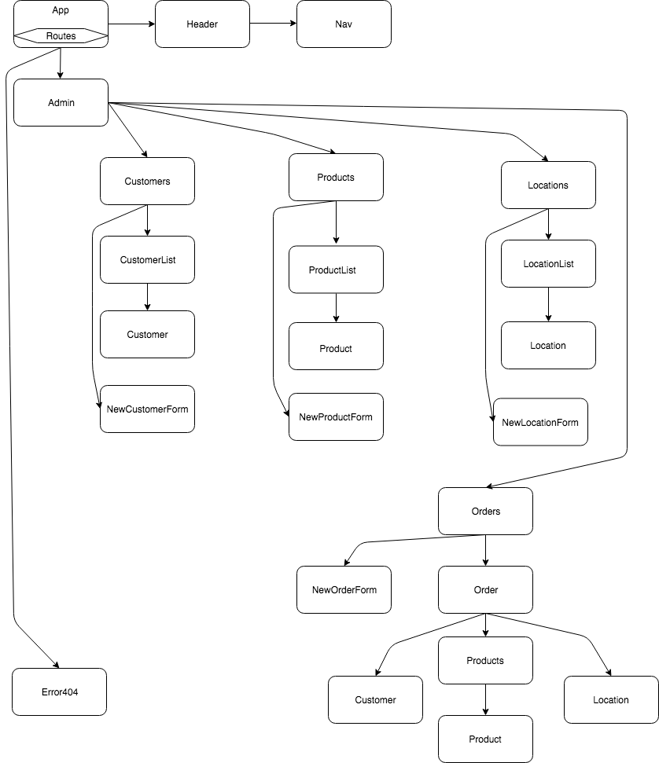

# PLANNING
This project is intended to be a website where customers can place orders for pick up at markets where Tumbleweed Bakehouse has booths. As of this writing, the project will focus on the Admin side. It will allow admin users to view and manage customers, orders, and products.

**[Component Tree](#component-tree)**<br>
**[Specifications](#specifications)**<br>
**[State](#state)**<br>

## Component Tree


## Specifications

### ADMIN USE CASES
#### Admin can manage Customers
  * View all Customers
  * Add a Customer
    * Enter Name
    * Enter Phone number
    * Enter Email address
    * Enter Postal code
  * Edit a Customer
    * Edit Name
    * Edit Phone number
    * Edit Email address
    * Edit Postal code
  * Delete a Customer


#### Admin can manage Products
  * View all Products
  * Add a Product
    * Enter Name
    * Enter Type
    * Enter Ingredients
    * Enter Description
    * Enter Price
  * Edit a Product
    * Enter Name
    * Enter Type
    * Enter Ingredients
    * Enter Description
    * Enter Price
  * Delete a Product


#### Admin can manage Orders
  * View all Orders
  * Add an Order
    * Enter Customer
    * Add Product
  * Edit an Order
    * Add Product
    * Remove Product
  * Delete an Order


#### Admin can manage pickup Locations
  * View all Locations
  * Add a Location
    * Enter Name
    * Enter Description
    * Enter Street Address & Postal code
  * Edit a Location
    * Edit Name
    * Edit Description
    * Edit Street Address & Postal code
  * Delete a Location


### ORDERS:
- Order number
- Customer
- Pickup Location
- Date & Time Order was placed
- Scheduled Pickup Date
- Date the Order was Picked up
- List of Products ordered
- Quantities for each Product ordered
- Subtotal for each Product ordered
- Order total
- Status: pending/complete


Orders will display the following . . .
- Customer
  * Name
  * Phone
  * Email


- Products
  * Name
  * Price
  * Quantity ordered
  * SubTotal


- Order
  * Order total
  * Pickup Location
  * Scheduled pickup date & time

## State
```
customers: {
    firstName: string,
    lastName: string,
    phone: string,
    email: string,
    postalCode: string,
  }

  products: {
    name: string,
    type: string,
    ingredients: string,
    description: string,
    price: number,
  }

  orders: {
    orderNumber: number,
    orderDateTime: date,
    scheduledPickupDate: date,
    scheduledPickupLocation: string,
    orderStatus: bool,
    productsOrdered: [
      {
        productId: string,
        quantityOrdered: number,
      }
    ],
  }

  locations: {
    name: string,
    description: string,
    streetAddress: string,
    postalCode: string,
  }

```
## Study/Research Work Log
- 9:30 AM: using draw.io to layout Admin homepage
- 9:45 AM: using draw.io to layout Admin homepage
- 10:30 AM: using draw.io to layout Component Tree
- 10:45 AM: using draw.io to layout Component Tree
- 11:15 AM: using draw.io to layout Component Tree
- 12:00 PM: reconfiguring Component Tree
- 12:15 PM: reconfiguring Component Tree
- 16:45 PM: reading Epicodus Redux curriculum in anticipation of refactoring Customers.
