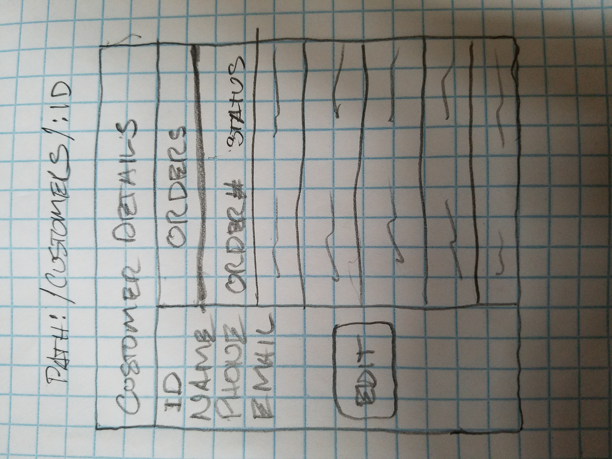
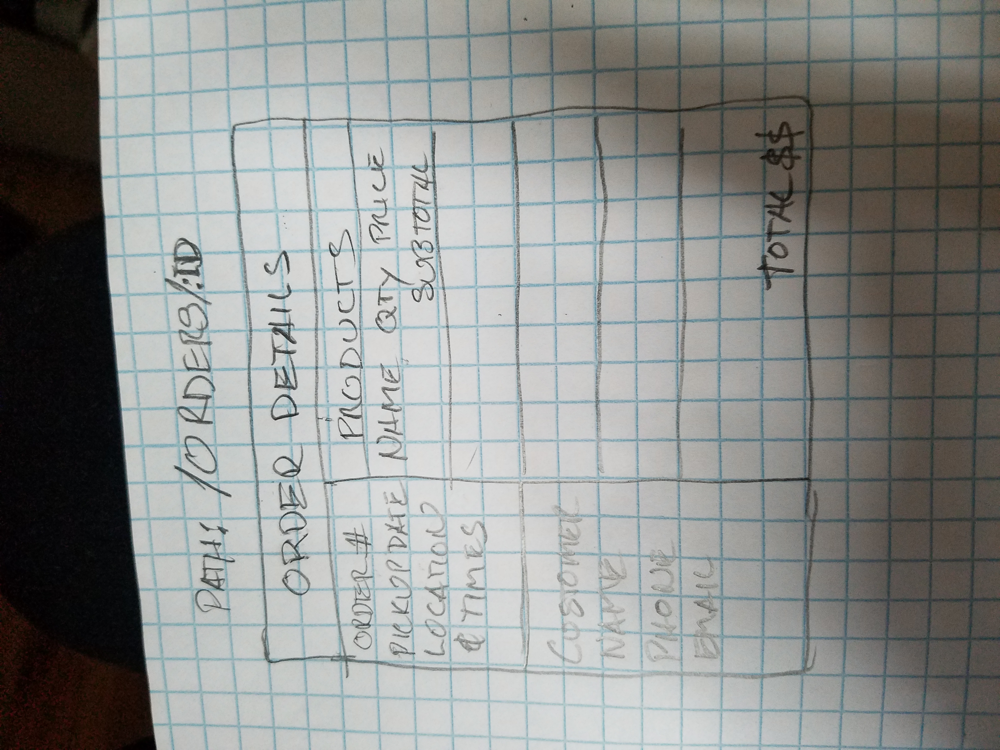
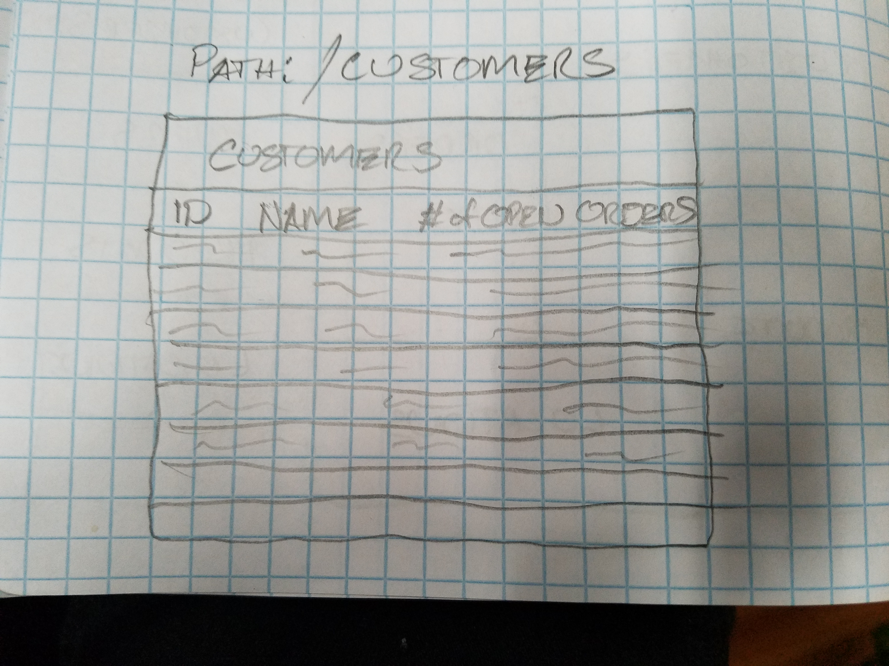
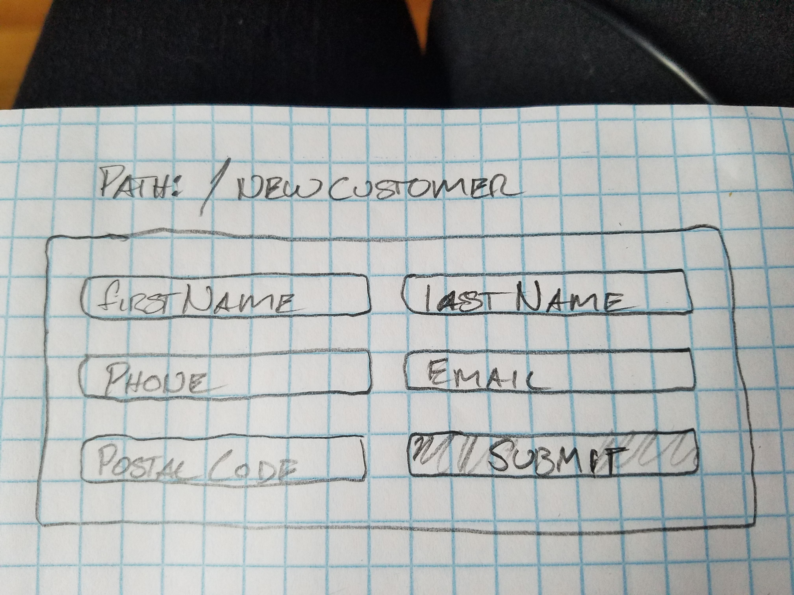
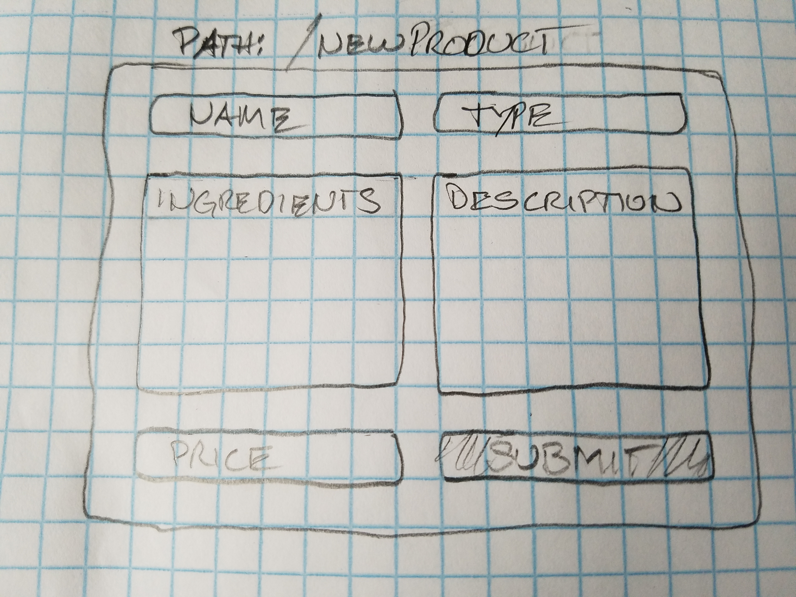
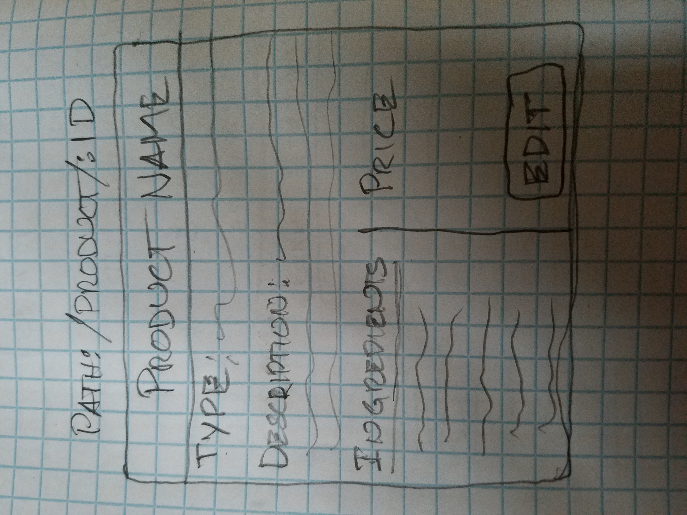
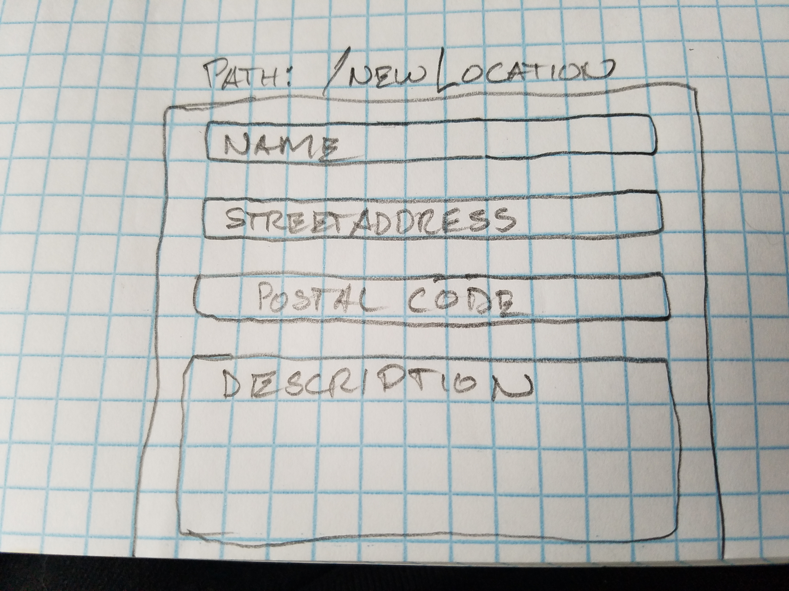

# PLANNING
This project is intended to be a website where customers can place orders for pick up at markets where Tumbleweed Bakehouse has booths. As of this writing, the project will focus on the Admin side. It will allow admin users to view and manage customers, orders, and products.

Includes visual representation of the capstone's planned layout/appearance.

**[Component Tree](#component-tree)**<br>
**[Specifications](#specifications)**<br>
**[State](#state)**<br>

## Component Tree


## Specifications

### ADMIN USE CASES
#### Admin can manage Customers
  * View all Customers
  * Add a Customer
    * Enter Name
    * Enter Phone number
    * Enter Email address
    * Enter Postal code
  * Edit a Customer
    * Edit Name
    * Edit Phone number
    * Edit Email address
    * Edit Postal code
  * Delete a Customer


#### Admin can manage Products
  * View all Products
  * Add a Product
    * Enter Name
    * Enter Type
    * Enter Ingredients
    * Enter Description
    * Enter Price
  * Edit a Product
    * Enter Name
    * Enter Type
    * Enter Ingredients
    * Enter Description
    * Enter Price
  * Delete a Product


#### Admin can manage Orders
  * View all Orders
  * Add an Order
    * Enter Customer
    * Add Product
  * Edit an Order
    * Add Product
    * Remove Product
  * Delete an Order


#### Admin can manage pickup Locations
  * View all Locations
  * Add a Location
    * Enter Name
    * Enter Description
    * Enter Street Address & Postal code
  * Edit a Location
    * Edit Name
    * Edit Description
    * Edit Street Address & Postal code
  * Delete a Location


## State-lifting
details how state will be structured and lifted  
Admin component will own state. State will be 4 arrays, one each for Customers, Locations, Orders, and Products. These will be arrays of objects. Each object will be structured as defined in the [following section](#state).  

Customers, Locations, Orders, and Products will each have a form to take user input and callback functions passed down from Admin as props. These callback will lift that data to Admin. Admin will update state accordingly.


## State
Lists all planned state   

**CUSTOMER**
```
customer: {
    firstName: string,
    lastName: string,
    phone: string,
    email: string,
    postalCode: string,
  }
```

**LOCATION**
```
  location: {
    name: string,
    description: string,
    streetAddress: string,
    postalCode: string,
  }

```

**ORDER**
```
  order: {
    orderNumber: string,
    customerId, string,
    orderDateTime: date,
    scheduledPickupDate: date,
    scheduledPickupLocation: string,
    orderStatus: bool,
    productsOrdered: [
      {
        productId: string,
        quantityOrdered: number,
      }
    ],
  }
```

**PRODUCT**
```
  product: {
    name: string,
    type: string,
    ingredients: string,
    description: string,
    price: number,
  }
```

### ORDER Component:
This component will need the following data to display an Order:

Because an Order will have customerId and an array that includes productId's, I can build logic to have Admin pass down the needed data to Orders.

- Order number
- Customer
- Pickup Location
- Date & Time Order was placed
- Scheduled Pickup Date
- Date the Order was Picked up
- List of Products ordered
- Quantities for each Product ordered
- Subtotal for each Product ordered
- Order total
- Status: pending/complete


Orders will display the following . . .
- Customer
  * Name
  * Phone
  * Email


- Products
  * Name
  * Price
  * Quantity ordered
  * SubTotal


- Order
  * Order number
  * Order total
  * Pickup Location
  * Scheduled pickup date & time

## VEIWS

### ADMIN


### CUSTOMER


### ORDER


### ORDERS


### CUSTOMERS


### NEW CUSTOMER


### NEW PRODUCT


### PRODUCT


### NEW LOCATION



## Study/Research Work Log 3/1/2019
- 9:30 AM: using draw.io to layout Admin homepage
- 9:45 AM: using draw.io to layout Admin homepage
- 10:30 AM: using draw.io to layout Component Tree
- 10:45 AM: using draw.io to layout Component Tree
- 11:15 AM: using draw.io to layout Component Tree
- 12:00 PM: reconfiguring Component Tree
- 12:15 PM: reconfiguring Component Tree
- 16:45 PM: reading Epicodus Redux curriculum in anticipation of refactoring Customers.

## Study/Research Work Log 3/8/2019
- 08:05 AM: Planning path: /admin layout
- 016:03 PM: Researching hiding child components & revealing them depending on routes.

## Study/Research Work Log 3/11/2019
- 09:30 AM: Researching routing for displaying something like: /admin/customers/:customerId.
- 10:30 AM: Continuing routing research.
- 12:15 PM: Routing issue solved; working on passing relevant data to <Customer />.
